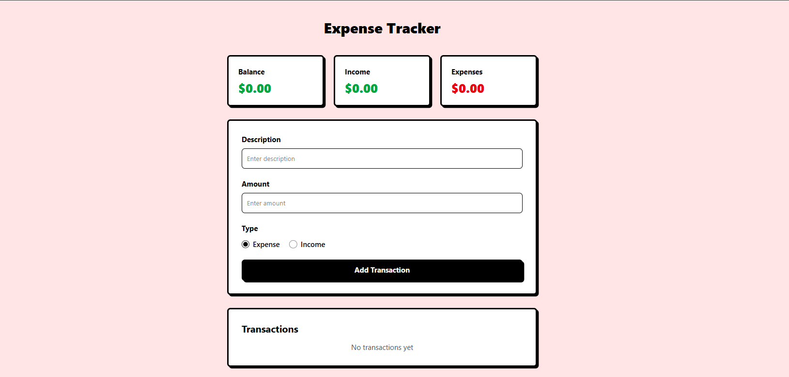

# Expense Tracker

A simple and intuitive expense tracker application built with React.


## Features

- Add new transactions (both income and expenses).
- View a list of all transactions.
- See the current balance, total income, and total expenses.
- Delete existing transactions.
- Responsive design that works on different screen sizes.

## Tech Stack

- **Frontend:** React, Vite
- **Styling:** Tailwind CSS

## Getting Started

To get a local copy up and running, follow these simple steps.

### Prerequisites

- Node.js and npm (or yarn) installed on your machine.

### Installation

1. Clone the repo:
   ```sh
   git clone https://github.com/your_username/expense-tracker.git
   ```
2. Navigate to the project directory:
   ```sh
   cd expense-tracker
   ```
3. Install NPM packages:
   ```sh
   npm install
   ```

### Running the Application

To run the app in development mode, execute the following command:

```sh
npm run dev
```

This will start the development server, and you can view the application by navigating to `http://localhost:5173` in your browser.

## Available Scripts

In the project directory, you can run:

- `npm run dev`: Runs the app in the development mode.
- `npm run build`: Builds the app for production to the `dist` folder.
- `npm run lint`: Lints the project files using ESLint.
- `npm run preview`: Serves the production build locally for preview.

## File Structure

```
/
├── public/
│   └── logo.png
├── src/
│   ├── components/
│   │   ├── Balance.jsx
│   │   ├── TransactionForm.jsx
│   │   └── TransactionList.jsx
│   ├── hooks/
│   │   └── useTransactions.js
│   ├── App.jsx
│   ├── index.css
│   └── main.jsx
├── .gitignore
├── package.json
└── vite.config.js
```

## Components

### `App.jsx`

The main component that orchestrates the entire application. It fetches and manages the application state using the `useTransactions` hook and renders the `Balance`, `TransactionForm`, and `TransactionList` components.

### `Balance.jsx`

A presentational component that displays the current balance, total income, and total expenses.

### `TransactionForm.jsx`

A form component that allows users to add new transactions. It captures the transaction description, amount, and type (income or expense).

### `TransactionList.jsx`

A component that displays a list of all transactions. It also provides a button to delete each transaction.

## Hooks

### `useTransactions.js`

A custom hook that encapsulates the business logic for managing transactions. It handles adding, deleting, and calculating the balance, total income, and total expenses.